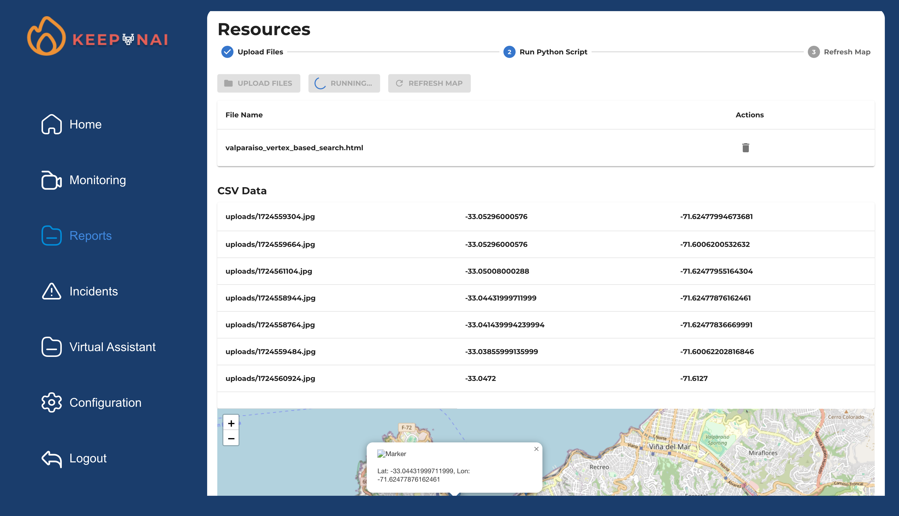
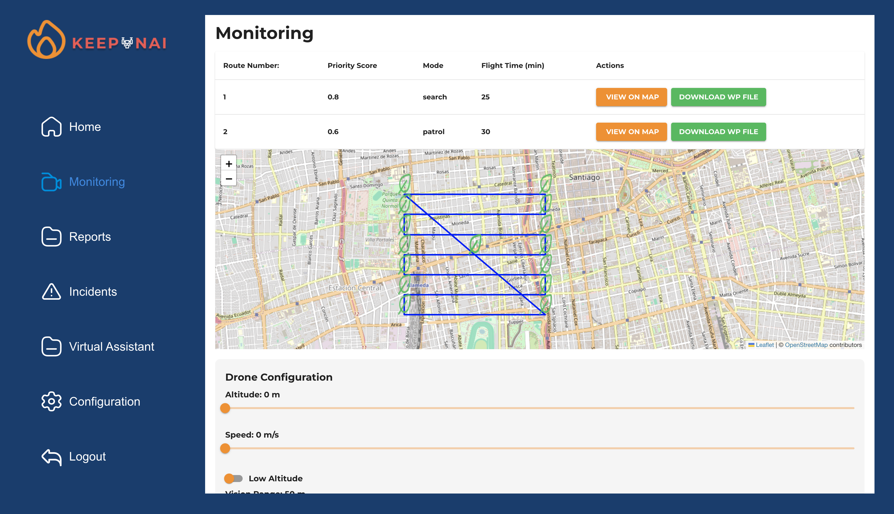
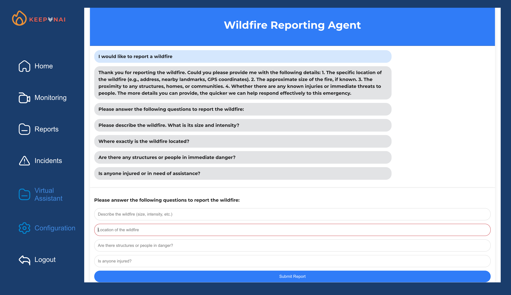

# KEEPNAI Dashboard

KEEPNAI Dashboard is an emergency-management and fire-monitoring application designed for both emergency personnel and local users.  
It provides real-time visualization of incidents, resource allocation, drone-based monitoring, and environmental conditions — all through an intuitive, modern interface.

---

## 📌 Features

### 🔥 Real-Time Incident Monitoring
- Interactive map displaying active fires, impacted areas, and deployed resources.
- Weather and environmental data to support decision-making.

### 🚁 Drone Route Analysis
- Trigger a built-in algorithm to compute optimal drone flight paths.
- Upload drone-collected data to detect fire presence and update the dashboard.

### 📊 Data & Reports
- Upload structured drone datasets for automated incident classification.
- Future: detailed reporting tools for post-incident analysis.

### ⚙️ User Profiles
- Emergency personnel dashboard with advanced monitoring tools.
- Local user dashboard focused on reports and simplified alerts.
- Future: custom preferences and configuration settings.

---

## 🧰 Technologies Used

### Frontend
- Next.js
- React
- Styled-Components
- React Router
- Google Fonts

### Backend
- Flask

### Other Tools
- Node.js  
- Git / GitHub  
- Python virtual environments  

---

## 📂 Project Structure

```
KEEPNAI/
├── frontend/        # Next.js UI (dashboards, maps, views)
├── backend/         # Flask API (data ingestion, detection, routing) - WIP
├── sample_data/     # Drone datasets for testing algorithms
└── README.md
```

---

## 🛠 Installation

### 1. Clone the repository

```bash
git clone https://github.com/AzulRK22/fire-eye-dashboard.git
cd fire-eye-dashboard
```

### 2. Frontend Setup

```bash
cd frontend
npm install
npm run dev
```

Frontend runs at: http://localhost:3000

---

### 3. Backend Setup

```bash
cd ../backend
python -m venv venv
source venv/bin/activate
pip install -r requirements.txt
flask db upgrade
```

Run backend:

```bash
flask run
# or
flask --app app.py --debug run
```

Backend default: http://localhost:5000

---

## 🚀 Usage

### Main Screen
Choose user role:
- Emergency Personnel → full monitoring dashboard  
- Local User → reports and basic information  

### Emergency Personnel Dashboard
- Map-based fire monitoring  
- Drone route analysis  
- Dataset upload for detection  
- (Future) Report generation  

### Local User Dashboard
- View incident summaries  
- Report history  
- (Future) Custom alert preferences  

---
## 🖼 Screenshots





---

## 🤝 Contributing

1. Fork the repository  
2. Create a branch:
```bash
git checkout -b feature/new-feature
```
3. Commit:
```bash
git commit -am "Add new functionality"
```
4. Push:
```bash
git push origin feature/new-feature
```
5. Open a Pull Request  

---

## 📝 License
MIT License  
